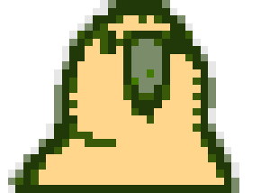
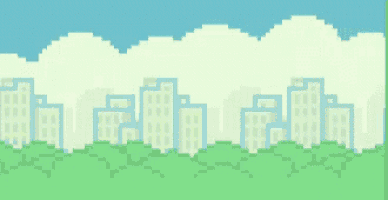

<h1>
        
         Olá, seja bem-vindo ao meu perfil do GitHub!
</h1>

        Sou <strong>Luis Gabriel Goés de Santana</strong>, um <strong>Desenvolvedor Full Stack</strong> apaixonado por
        tecnologia, desenvolvimento de
        software e inteligência artificial. Atualmente, curso <strong>Engenharia de Software</strong> na
        <strong>Universidade Católica de
                Salvador</strong> e tenho experiência em várias tecnologias, incluindo <strong>Java, Spring Boot,
                TypeScript, Angular, SQL Server</strong> e
        <strong>PostgreSQL</strong>.

<h2>    
        
        Sobre Mim</h2>

        Gosto de construir aplicações escaláveis e eficientes, aplicando <strong>Clean Code</strong> e <strong>Clean
                Architecture</strong> para garantir
        um código de qualidade. Meu foco está no desenvolvimento de sistemas modernos e na criação de soluções
        inovadoras.

<h2>🚀 Tecnologias e Ferramentas</h2>

<h3>Front-end</h3>

        
        
        
        
        
        

<h3>Back-end</h3>

        
        
        

<h3>Banco de Dados</h3>

        
        

<h3>Ferramentas e Metodologias</h3>

        
        
        
        

<h2>📊 Estatísticas do GitHub</h2>

        
        

<h2>
        
        Projetos Relevantes
</h2>

        <h3>Flappy Bird com Rede Neural</h3>
        

                
        

        

                Um projeto de Flappy Bird desenvolvido em <strong>Python</strong> utilizando <strong>Pygame</strong> e
                <strong>NEAT-Python</strong> como rede neural que aprende a jogar.
                O objetivo do projeto é criar um agente que se torne mais eficiente ao longo do tempo, utilizando
                aprendizado por reforço.
        

        <h4>Principais Tecnologias:</h4>
        <ul>
                <li><strong>Python</strong></li>
                <li><strong>Pygame</strong></li>
                <li><strong>NEAT-Python</strong></li>
        </ul>
        
Este projeto segue os princípios de <strong>Clean Code</strong> e utiliza <strong>Programação Orientada a
                        Objetos (POO)</strong> para garantir uma estrutura de código limpa e escalável.

<h2>
        
        Entre em Contato
</h2>

Você pode me encontrar nas redes sociais ou entrar em contato via:

        
        

